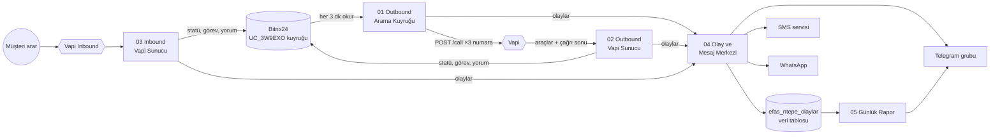

# EFAS N-TEPE — Yapay Zeka Arama, Randevu ve Raporlama Sistemi

Bitrix24 + n8n + Vapi ile **EFAS N-Tepe Yaşamkent** projesi için uçtan uca otomasyon:

- **Outbound:** Bitrix'te **EFAS N-TEPE YAPAY ZEKA** (`UC_3W9EXO`) statüsüne yüklenen lead'ler, **3 dakikada bir** turlarla **3 numaradan aynı anda** aranır.
- **Randevu:** Lead **YAPAY ZEKA RANDEVU OLUŞTURANLAR** (`UC_ML92HM`) statüsüne geçer. Sorumlusuna, randevu saatinde hatırlatmalı bir Bitrix görevi açılır.
- **Olumsuz:** Lead **EFAS N-TEPE OLUMSUZ** (`UC_PTDA4Y`) statüsüne geçer, nedeni kaydedilir.
- **Inbound:** Aynı 3 numarayı arayan kişi Bitrix'te bulunur ya da yeni lead olarak açılır; randevu alınır.
- **SMS + WhatsApp:** Randevu teyidi, ulaşılamayana tanıtım ve kararsız müşteriye bilgi mesajı gönderilir.
- **Telegram:** Her randevu gruba anında düşer. Gün içinde iki kez (13:30 ve 19:30) arama, randevu, SMS, WhatsApp, süre ve maliyet raporu gider.

Her görüşmenin özeti ve ses kaydı lead'in zaman akışına yorum olarak eklenir.



## Dosyalar

| Klasör | İçerik |
|---|---|
| `n8n/workflows/` | **İçe aktarılacak 6 workflow** (00–05) |
| `vapi/` | Asistan promptları, araç tanımları, Structured Output şemaları, WhatsApp şablonları ([kurulum](vapi/README.md)) |
| `n8n/src/` | Code node kaynakları. `node n8n/build.mjs` workflow JSON'larını bunlardan üretir |
| `test/` | Gerçek n8n üzerinde uçtan uca test (sahte Bitrix/Vapi/SMS/WhatsApp/Telegram sunucusu) |

## Kurulum (sırayla)

### 1. Bitrix24
- **Gelen webhook:** Geliştirici kaynakları > Diğer > Gelen webhook, **CRM** yetkisiyle oluşturun. Adres `https://…/rest/ID/KOD/` biçimindedir.
- Statü kodları hazır: `UC_3W9EXO`, `UC_PTDA4Y`, `UC_ML92HM`.
- **Otomasyon kuralı gerekmez.** Kuyruğu n8n kendisi okur. Statüye toplu yükleme yaptığınızda yüzlerce robot webhook'u aynı anda tetiklenmez; "3 dakikada 3 arama" sınırı da böylece korunur.
  İsterseniz `UC_ML92HM` statüsüne kendi robotlarınızı (bildirim, SMS vb.) ekleyebilirsiniz. Statü değişikliği REST ile yapıldığı için robotlar normal şekilde çalışır.

### 2. n8n credential'ları
| Ad (aynen) | Tür | Değer |
|---|---|---|
| `Vapi API` | Header Auth | Name `Authorization`, Value `Bearer <Vapi private key>` |
| `WhatsApp API` | Header Auth | Name `Authorization`, Value `Bearer <Meta kalıcı token>`. Henüz yoksa geçici değerle oluşturun |
| `EFAS Telegram Bot` | Telegram API | BotFather token'ı *(bot rapor grubuna eklenmeli)* |

### 3. Workflow'ları içe aktarın
`n8n/workflows/` içindeki 6 dosyayı içe aktarın (Workflows > Import from File). Her birinde **AYARLAR** node'u var. Değerleri **hepsinde aynı** girin:

| Ayar | Ne yazılır |
|---|---|
| `BITRIX_WEBHOOK` | 1. adımdaki adres (sonu `/`) |
| `VAPI_OUTBOUND_ASISTAN` / `VAPI_INBOUND_ASISTAN` | Asistanın Vapi'deki **adı** (varsayılan `EFAS N-TEPE - OUTBOUND` / `- INBOUND`) ya da ID'si. Aynı adı verirseniz değiştirmeniz gerekmez |
| `OLAY_WEBHOOK_URL` | Boş bırakın; n8n kendi adresinden bulur. Farklı bir adres gerekiyorsa 04'teki webhook'un Production URL'ini yazın |
| `RANDEVU_SORUMLU_IDLERI` | Boşsa randevu lead'in **mevcut sorumlusuna** gider. `[12, 45]` gibi doldurulursa randevular bu Bitrix kullanıcılarına sırayla dağıtılır |
| `INBOUND_SORUMLU_IDLERI`, `VARSAYILAN_SORUMLU_ID` | Inbound'da yeni açılan lead'lerin sorumluları |
| `SMS`, `WHATSAPP`, `TELEGRAM` | Kanal bilgileri. `AKTIF: true` ile açılır |
| `ARAMA_SAATLERI` | Varsayılan: Pzt–Cmt 10:00–19:00 |
| `RANDEVU_SAATLERI` | Varsayılan: her gün 10:00–18:00. Prompttaki saatle aynı olmalı |

### 4. Kontrol
1. **04 Olay ve Mesaj Merkezi**'ni aktif edin.
2. **00 Kurulum ve Kontrol**'ü elle bir kez çalıştırın. Bu workflow Bitrix'te 5 lead alanını (`UF_CRM_EFAS_AI_*`) ve `efas_ntepe_olaylar` veri tablosunu oluşturur. Ayrıca statüleri, Vapi numaralarını ve asistanlarını kontrol eder.
3. Son node'daki `rapor` alanında ❌ satırı kalmayana kadar düzeltin.

### 5. Vapi
[vapi/README.md](vapi/README.md) adımlarını uygulayın: iki asistan, araçlar, Server URL ve Structured Output. Ardından 3 numaranın inbound asistanını EFAS yapın.

> ⚠️ Bu 3 numara şu an **TOPRAKTAN CITY** asistanlarına bağlı. Inbound atamasını değiştirdiğinizde bu numaraları geri arayan Topraktan müşterileri EFAS asistanına düşer.

### 6. Aktif etme sırası
**02**, **03** ve **05**'i aktif edin, **00**'ı tekrar çalıştırın. En son **01**'i aktif edin; 01 aktif olduğu anda arama başlar.
İlk testte `UC_3W9EXO` statüsüne yalnızca kendi numaranızla tek bir lead koyun.

## Nasıl çalışır

### Outbound kuyruk (01, her 3 dakikada)
1. Arama saatleri dışındaysa hiçbir şey yapmaz.
2. `UC_3W9EXO`'daki lead'leri okur (sayfa sayfa, en fazla 2.000).
3. Vapi'de o an görüşmede olan numaraları (inbound dahil) atlar. Boş numaralara birer lead verir ve aramaları **aynı anda** başlatır.
4. Sıralama: müşterinin "şu saatte arayın" dediği geri aramalar → zamanı gelen tekrar denemeler → hiç aranmamış lead'ler.
5. Aranan lead **kilitlenir** (`SONRAKI` = şimdi + 30 dk), böylece bir sonraki turda tekrar seçilmez.

### Sonuçlar
| Durum | Ne olur |
|---|---|
| Randevu (görüşme sırasında `randevu_olustur`) | Statü `UC_ML92HM`, sorumluya görev açılır (1 gün ve 1 saat önce hatırlatma), müşteriye SMS + WhatsApp teyidi, Telegram'a anlık bildirim |
| Randevu konuşuldu ama araç çağrılmadı | Statü `UC_ML92HM`, sorumluya **"randevu TEYİDİ"** görevi açılır (saat teyit edilmeli) |
| Olumsuz / yanlış numara / aranmak istemiyor | Statü `UC_PTDA4Y`, nedeni `UF_CRM_EFAS_AI_RES` alanına yazılır |
| "Sonra arayın" (`geri_arama_planla`) | Kuyrukta kalır, istenen saatte aranır; lead'e +2 arama hakkı tanınır |
| Açmadı / meşgul / operatör anonsu | 120 dk sonra tekrar aranır. İlk denemede tanıtım SMS'i ve WhatsApp'ı gider. 3. denemede de ulaşılamazsa `UC_PTDA4Y` |
| Görüştü ama karar vermedi | 1 gün sonra tekrar aranır, WhatsApp bilgi mesajı gider. 3 görüşmede sonuç çıkmazsa `UC_PTDA4Y` |
| Numara geçersiz | `UC_PTDA4Y` (`GECERSIZ_NUMARA`) |

**Lead alanları:** `UF_CRM_EFAS_AI_TRY` (deneme), `_NEXT` (sonraki arama), `_RES` (son sonuç), `_CALL` (Vapi call ID), `_APPT` (randevu).
Bir lead'i baştan aratmak için `_TRY` ve `_NEXT` alanlarını temizleyip lead'i `UC_3W9EXO`'ya taşıyın. Sistem lead'i kuyruktan çıkarırken bu alanları zaten sıfırlar.

### Inbound (03)
Arayan numara Bitrix'te aranır ve **bu projeye ait** en yeni lead seçilir. Başka projenin lead'ine dokunulmaz.
- **Randevu:** Lead güncellenir ya da yeni lead açılır → `UC_ML92HM` + görev.
- **Bilgi aldı / sonra aranmak istiyor:** Sorumluya "müşteriye dönüş yapın" görevi açılır. Yeni arayansa **EFAS İÇİN GELEN** (`UC_PQDHUK`) statüsünde lead açılır.
- **Olumsuz:** Kuyruktaki lead `UC_PTDA4Y`'ye taşınır.

## Günde 1.000 arama
Günlük kapasite ≈ (60 ÷ tur dakikası) × `TUR_BASINA_MAX_ARAMA` × çalışma saati:

| Ayar | Günlük (10:00–19:00) |
|---|---|
| 3 dk, 3 arama (varsayılan; numara başına 1 eşzamanlı) | ~540 |
| 3 dk, 6 arama (`HAT_BASINA_ESZAMANLI: 2`) | **~1.080** |
| 2 dk, 6 arama | ~1.620 |

1.000/gün için Netgsm SIP hattının numara başına **en az 2 eşzamanlı kanala** izin vermesi gerekir. Vapi hesabındaki eşzamanlı arama limiti de en az 6 olmalı. Arama sıklığı 01'deki "Her 3 Dakikada Bir" tetikleyicisinden değiştirilir.
Maliyet: dashboard'daki ~$0,08/dk ile günde 1.000 arama kabaca **$40–80/gün** eder. Gerçek tutar ulaşma oranına ve konuşma süresine bağlıdır ve Telegram raporunda her gün görünür. Vapi bakiyesini buna göre yükleyin.

## SMS, WhatsApp ve Telegram
- **SMS (CORPORATESMS XML servisi):** AYARLAR > `SMS` içine `API_URL`, `KULLANICI`, `SIFRE`, `BASLIK` girip `AKTIF: true` yapın. Metinler `SMS.METIN` içinde; `{ad}`, `{tarih}`, `{telefon}` yer tutucuları kullanılabilir.
  ⚖️ Tanıtım SMS'i **ticari elektronik ileti**dir. Yalnızca İYS'de onayı olan numaralara gönderilmelidir. Randevu teyidi bilgilendirme amaçlıdır.
- **WhatsApp (Meta Cloud API):** `WHATSAPP.AKTIF: true` ve `TELEFON_NUMARASI_ID`. Şablonlar Meta'da onaylı olmalı ([şablon metinleri](vapi/README.md#4-whatsapp-şablonları-meta-business-manager)). Pazarlama şablonları için de İYS/opt-in kuralları geçerlidir.
- **Telegram:** Botu gruba ekleyin. Grup ID'sini (`-100…`) `TELEGRAM.CHAT_ID`'ye yazıp `AKTIF: true` yapın. Rapor saatleri 05'teki cron ifadesindedir (`30 13,19 * * *`).

Örnek rapor:
```
📊 EFAS N-TEPE — Yapay Zeka Gün Sonu Raporu
📞 Arama: 1.040 (başlatılamayan 3)
✅ Ulaşılan: 402 · 📵 Ulaşılamayan: 635 · Ulaşma %39
📥 Gelen arama (inbound): 27
📅 Randevu: 38 (outbound 31 · inbound 7 · teyit bekleyen 2)
🔁 Geri arama sözü: 55 · ❌ Olumsuz: 141
💬 SMS: 412 · WhatsApp: 455
⏱ Konuşma: 812 dk · 💰 Vapi: $71.40
📋 Kuyrukta bekleyen lead: 2.310
Bugünün randevuları
• Ahmet Yılmaz — 07.10.2026 Çarşamba 14:00
…
```

## Notlar
- **n8n sürümü:** Data Tables (olay tablosu) için n8n ≥ 1.113 / 2.x gerekir. Workflow'lar n8n 2.42.3 üzerinde test edildi.
- **Fiyat listesi** promptlarda ve WhatsApp şablonlarında Ekim 2026 listesine göre yazıldı. Liste değişince `vapi/*-sistem-promptu.md` ve şablonları güncelleyin.
- İki fiyat listesindeki **brüt m²** değerleri tutarsız: 1+1 nakit listede 49 m², vadeli listede 47 m²; 2+1 A tipinde 73 ve 70 m². Bu yüzden asistan yalnızca net m² söyler.
- Vapi webhook'larını korumak için 02 ve 03'teki Webhook node'larında *Header Auth* açıp aynı başlığı Vapi'de Server URL > HTTP Headers'a ekleyebilirsiniz.

## Geliştirici
```bash
node n8n/build.mjs                  # src/ → n8n/workflows/*.json
node test/lib.test.mjs              # yardımcı fonksiyon testleri
# Uçtan uca test (yerel n8n ≥ 2.x gerekir):
node n8n/build.mjs --test test/ayarlar.test.json   # test/.build/ (adresler sahte sunucuya)
node test/mock-server.mjs &                        # sahte Bitrix/Vapi/SMS/WhatsApp/Telegram :8787
# test/.build/*.json'u n8n'e import + publish edin; credential'lar için test/credentials.test.json
node test/e2e.mjs                                  # 70 kontrol
```
Code node'larını n8n arayüzünde değil `n8n/src/nodes/*.js` dosyalarında düzenleyin. Ortak fonksiyonlar `n8n/src/lib.js`'tedir, ayarlar `n8n/src/ayarlar.js`'tedir. Değişiklikten sonra build alın.
